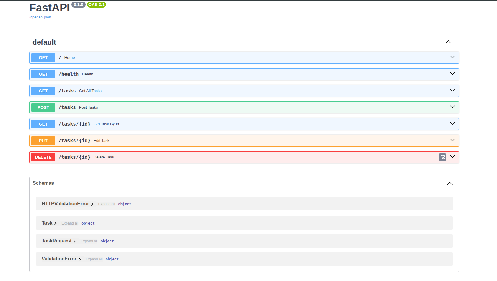

# firstcrud_api
This is the in memory crud app to understand how a simple backend works

# APIs

## GET /
Home
welcome to the server

## GET /health
Health
gets helath check of server

## GET /tasks
Get All Tasks
returns all tasks

## POST /tasks
Post Tasks
create a task

## GET /tasks/{id}
Get Task By Id


## PUT /tasks/{id}
Edit Task


## DELETE /tasks/{id} 
Delete Task


## these are end points in swagger UI




## 🚀 How to Start the Project

Anyone cloning this repository can get up and running instantly. The database and tables will be generated automatically on your first run.


1. **Clone the repository:**

   ```bash
   git clone https://github.com/THELITEESHREDDY/firstcrud_api
   cd firstcrud_pi
   ```

2. **Set up a virtual environment:**

   ```bash
   python3 -m venv env
   source env/bin/activate
   ```


3. **Install dependencies:**

   ```bash
   pip install -r requirements.txt
   ```

4. **Start the server:**

   ```bash
   uvicorn main:app --reload
   ```
   *The database layout file will be automatically generated instantly upon startup.*


## 💾 Database Architecture


### Why SQLite was Chosen

* **Zero Configuration**: Requires no external server setup, standalone background containers, or credential management.

* **File-Based**: Entirely contained in a local disk block, making it lightweight for development workflows.

* **Fast Testing**: Runs reliably inside a localized environment for prototype validation.


### Database File Storage Location

The active database file is stored locally within the project root directory as:
`./database.db`


### Database Viewer Screenshot

Below is a visual snapshot of the compiled tables verified through our local database tool:


 


### Example SQL Query Executed

Here is a raw SQL transaction executed against the database instance to search for specific keyword criteria:


```sql
SELECT task_table.id, task_table.title, task_table.done 
FROM task_table 
WHERE lower(task_table.title) LIKE lower('%milk%');
```